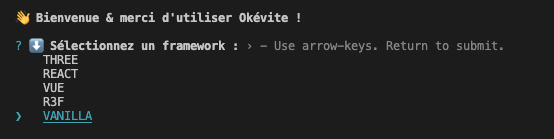

<p align="center">
  <a href="https://okan3d.com/" target="_blank" rel="noopener noreferrer">
    
  </a>
</p>

# Okévite
> Outil simplifié de Vite. Téléchargement de boilerplate en ligne de commande.

<br>

✅ ***N'HESITEZ PAS A FORK CE PROJET POUR CRÉEZ VOTRE PROPRE VITE PERSONALISÉ***
<br>

## Installation 

Pour commencer, il faut installer Okévite depuis npm :

```bash
npm i -g okevite 
```
Ensuite vous pouvez lancer Okévite avec la commande 

```bash
okevite
```

## Fonctionnement 
 
Apres avoir executer la commande okevite, le script se lance.

<p align="center">
    
</p>

Selectionnez le framework voulu, le dossier se télécharge.

## Configuration de votre Okévite

Pour personaliser okevite, il suffit de modifier certains parametres dans le fichier okevite.js

-  Le lien de votre repo contenant vos boilerplate
-  Le nom des dossiers ou se trouve vos boilerplate 

Pour cela remplacer le lien par le votre (ligne 42)
Et remplacer dans la variable option, vos nom de dossiers.

<br>

## Publication 

Les etapes pour publier le paquet sur npm.

Tout d'abord assurer vous de changer le numero de version a chaque publication sur npm. Vous pouvez changer le numero dans le fichier ```package.json``` 

Connectez vous à npm depuis le navigateur en lançant cette commande.

```bash
npm login
```
Ensuite vous puvez publier une nouvelle version du projet sur votre npm en executant la commande : 

```bash
npm publish
```

Evidement si vous avez fork le projet il faudra changer son nom dans le package.json 

## Developpeur

- [@baptiste-bussiere](https://github.com/baptiste-bussiere)


